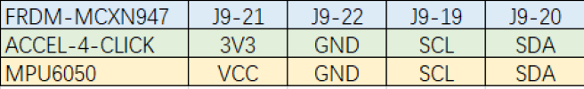

# NXP Application Code Hub

## On-device training fan anomaly detection on MCXN947

On-device trainable anomaly detection based on the MCX platform. Train the SVM model on-device with normal accelerometer data
and inference SVM model on-device too. 

Because data patterns are often very different or vary among the device life cycle.

During the whole life cycle of a device, learning may need to be done multiple times.

The GUI is implemented by LVGL.

#### Boards: FRDM-MCXN947

#### Categories: AI/ML, Anomaly Detection

#### Peripherals: DISPLAY, I2C

#### Toolchains: MCUXpresso IDE, VS Code

## Table of Contents

1. [Software](#step1)
2. [Hardware](#step2)
3. [Setup](#step3)
4. [Results](#step4)
5. [FAQs](#step5)
6. [Support](#step6)
7. [Release Notes](#step7)

## 1. Software 

- Download [SDK_2_14_0_FRDM-MCXN947](https://mcuxpresso.nxp.com/en/welcome)
- Download and install [MCUXpresso IDE V11.9.0 or later](https://www.nxp.com/design/design-center/software/development-software/mcuxpresso-software-and-tools-/mcuxpresso-integrated-development-environment-ide:MCUXpresso-IDE).

## 2. Hardware 

* 3.5" TFT LCD module by NXP (P/N PAR-LCD-S035)
* FRDM-MCXN947(SCH-90818_REV B) board
* IMU(Inertial Measurement Unit) Sensor: MPU6050 module or FXLS8974 [ACCEL-4-CLICK](https://www.mikroe.com/accel-4-click)
* FAN
* Type-C USB cable

## 3. Setup 

### 3.1 Step 1 Setup hardware

* Stick the IMU(6050) Sensor on the FAN like:

or IMU(FXLS8974)

* Connect IMU with FRDM-MCXN947 board, connection is shown in the table:

* Connect LCD Panel with J8 FRDM-MCXN947 board.
* The whole system is shown as:

IMU(MPU6050)

or IMU(FXLS8974)

Connect the debug port on board with the laptop.

### 3.2 Step 2

#### Develop in MCUXpresso IDE

Import the project into MCUXpresso IDE, click 'Import project from Application Code Hub', search 'on-device training fan anomaly on mcxn947' example, and clone to the local workspace.

Build the project, after compilation is complete, use the GUI Flash Tool (2 in the following figure) to write the program to the board.

#### Develop in VS code

In VS code, select the 'MCUXpresso For VScode' plugin, and click 'Application Code Hub' in the QUICKSTART PANEL. 
search 'on-device training fan anomaly on mcxn947' example, clone to local workspace.

After a while, the project is shown in the 'Projects'.

Build the project, after compile complete flash the board.

## 4. Results 

Reset board, the main windows showing as:

### 4.1 Normal state training

Set the fan in the normal state, click the 'Train' button, and enter the training window. 

Click the start button to start training. Notice that don't move or touch the fun during the training.

After training is complete, click return back to the main window.
The window shows the normal status, Green LED at the top is on.

### 4.2 Anomaly state detection

Flip the Fan over, then the data of IMU is changed, and then the normal status is detected. The red LED at the top is on.
  

### 4.3 Other scenario

* Cover the fan then anomaly state is detected.
  

  
* Retrain the model, after training complete state is normal.

* Remove the cover, then the anomaly state is detected.

For more details about the demo, please refer to the video. 

(**image/how_to_run.mp4**).

<video id="video" controls="" preload="none" poster="tony">
<source id="mp4" src="./image/how_to_run.mp4" type="video/mp4">
</video>

## 5. FAQs 

*No FAQs have been identified for this project.*

## 6. Support 

*Please contact NXP for additional support.*

#### Project Metadata

<!----- Boards ----->

<!----- Categories ----->

 

<!----- Peripherals ----->

 

<!----- Toolchains ----->

Questions regarding the content/correctness of this example can be entered as Issues within this GitHub repository.

> **Warning**: For more general technical questions regarding NXP Microcontrollers and the difference in expected funcionality, enter your questions on the [NXP Community Forum](https://community.nxp.com/)

## 7. Release Notes 

| Version | Description / Update                    |                                   Date |
| :-----: | --------------------------------------- | -------------------------------------: |
|   1.0   | Initial release on Application Code Hub | January 30 th  2024 |